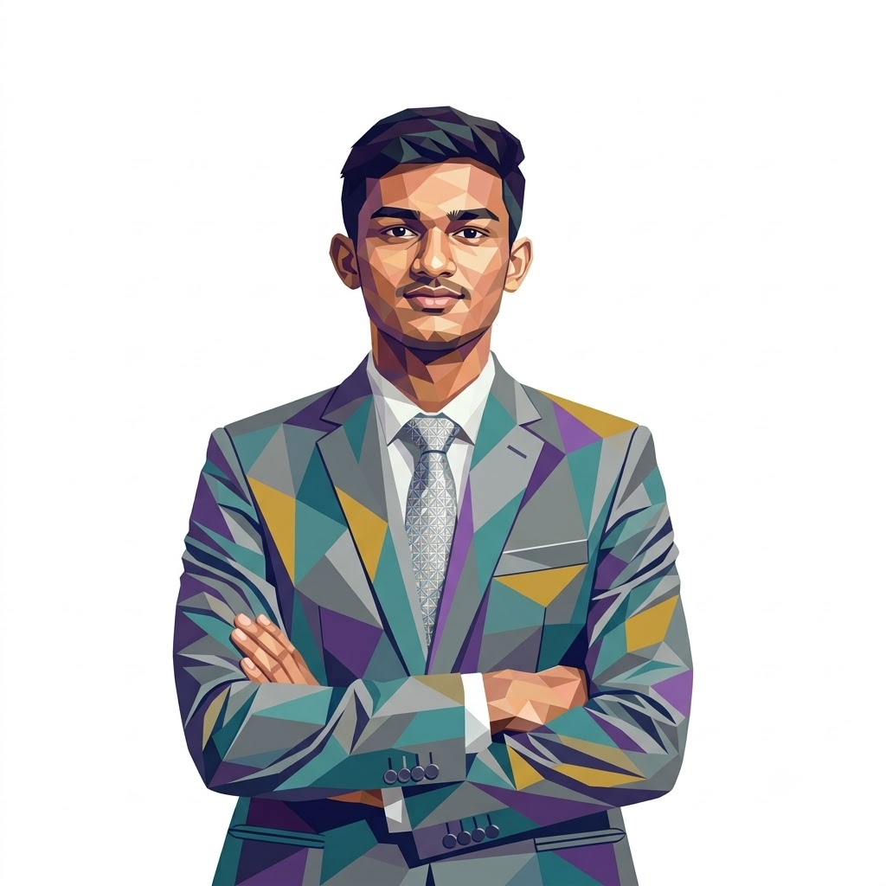

<table>
<tr>
<td width="100%" valign="middle">

<h1>Sudip R. Kurundwade</h1>

<p>
  <strong>Trainee Software Engineer | Java | Full-Stack Development | Problem Solving</strong>
</p>

<br>

<p>
  <a href="https://sudipkurundwade.github.io/portfolio/">
    
  </a>
  <a href="https://www.linkedin.com/in/sudip-kurundwade-8ab3902b0/">
    
  </a>
  <a href="mailto:sudipkurundwade@gmail.com">
    
  </a>
</p>

</td>

<td width="35%" align="center" valign="middle">



</td>
</tr>
</table>

---


---

## About Me

Final-year Computer Science student focused on practical, well-structured software. I enjoy building full-stack applications, strengthening my Java backend skills, and turning real workflows into clear user experiences.

```text
Currently focused on: Java, DSA, MySQL, Spring Boot, and full-stack development
Problem solving: 250+ LeetCode problems
Education: B.Tech Computer Science, CGPA 8.45
Volunteer role: Technical Head, byteARQ Technical Club
Location: Ichalkaranji, Maharashtra, India
```

## Featured Work

| Project | What it does | Stack |
| --- | --- | --- |
| [ERP-based Student Management System](https://github.com/sudipkurundwade0101/ERP) | Role-based workflows for admissions, fees, hostels, examinations, and academic operations. | React, Node.js, Express, MongoDB, JWT |
| [Civic Issue Reporter](https://github.com/siddhumore18/SGU_Hackathon_2025) | AI-assisted civic reporting and governance workflows for more accountable issue resolution. | React, Node.js, Express, MongoDB, Gemini AI |
| [iCAM](https://github.com/sudipkurundwade0101/iCAM) | Android product identification app with two ML models for FMCG products and fruits or vegetables. | Java, Android, TensorFlow Lite |
| [ByteArq](https://github.com/sudipkurundwade0101/bytearq_) | Vite and React application with a MongoDB API structured for Vercel serverless deployment. | React, Vite, Node.js, MongoDB, Vercel |
| [Web Builder](https://github.com/sudipkurundwade/web_builder) | Creation platform for web projects, templates, reusable blocks, uploads, and AI-assisted workflows. | Node.js, Express, MongoDB, Gemini AI |
| [Slynk](https://github.com/siddhumore18/Slynk) | Platform connecting entrepreneurs, investors, and freelancers through collaboration tools. | React, Firebase, Express, Socket.IO, LiveKit |

## Tech Stack

<p>
  
</p>

## Highlights

<p>
  
  
  
</p>

## GitHub Activity

<p align="center">
  
  
</p>

<p align="center">
  
</p>

<p align="center">
  <strong>Build useful software. Learn continuously. Solve real problems.</strong>
</p>
